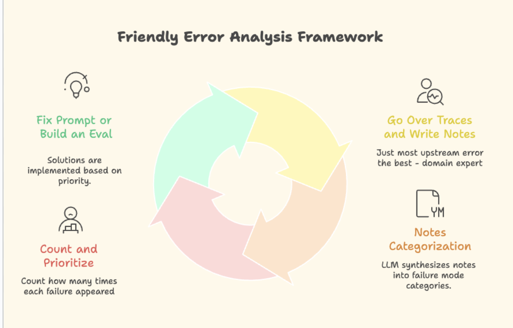

זהו cheat sheet של ההרצאה שלי "Why Am I So Obsseded with Evals״. יש הרבה תוכן באינטרנט והרגשתי שרובו מבולגן/יותר מדי כללי, אז פה מופיע הסבר קצר בתוספת הדעות האישיות שלי. אם לא הייתם בהרצאה שלי ורוצים לשמוע עוד, תגידו. 

**ההבטחה**: GenAI יוצר את התחושה שנורא קל לעשות דברים. באמת קל להגיע למשהו שעובד ב-90% מהמקרים, אבל המרחק ל99% או ל100% הוא קשה - ואני מאמינה ש-Evals יכולים לאפשר לנו להגיע לשם. 

**על מה בעצם אני מדברת כשאני מדברת על Evals**? מדובר על אוסף של מבחנים קטנים שבודקים את ה-output של המודל. יכולים להיות: 
1. Code Evals - למשל, לוודא שה-output הוא json, אורך, כמות תשובות וכו׳. פשוטים ומדויקים. 
2. LLM-as-a-judge - מבקשים ממודל לשפוט את התוצר של מודל אחר. עדיף מאוד שיהיה בינארי, וכמה שיותר ספציפי, יותר טוב.
	1. שאלה טובה: ״האם התשובה מכילה מידע רפואי? תענה בכן/לא״ 
	2. שאלה פחות טובה: ״תדרג עד כמה התשובה מדויקת מ-1-5״ 
3. Evals for evaluators - דירוג שנעשה למודל ששופט. הכי נפוץ יהיה להשוות את התשובות שה-LLM-as-a-judge נתן לדאטה שהוא human labeled. למשל, ״האם התשובה של המודל זהה לתשובה שנתן ה-domain expert שלנו?״ 

**איך מתחילים?** 

לפני שאנחנו מתחילים הטמעה של מודל AI במוצר, קריטי להגדיר (כמו בכל פרויקט) - איך תיראה הצלחה, איך ייראו כישלונות ומה הסכנות. למשל, אם אנחנו רוצים להטמיע support chatbot - אנחנו מאוד מאוד לא רוצים שהוא ייתן ללקוחות מידע על לקוחות אחרים. אז אנחנו נשב ונאפיין ממש ממש לעומק. 

תוצר האפיון יכול להיות אוסף דוגמאות חיוביות ושליליות/Ground Truth שנאסף ע״י מומחים אנושיים, או system prompt מאוד ארוך עם כל ההנחיות שלנו למודל. 

אבל, מניסיון כואב - זה כמעט אף פעם לא מספיק. אנחנו מתחילים ומגלים מקרי קצה שלא חשבנו עליהם, המודל מזהה מקרים שלא מצאנו ואז צריך להוסיף אותם לדאטהסט, המודל מתנהג בדרך שלא ציפינו וצריך לעדכן את הפרומפט - זה הגיוני, בלתי אפשרי לחשוב מראש על הכל. 

**אז מה עושים?** מצאתי לאחרונה [framework מעניין](https://hamel.dev/blog/posts/evals-faq/) של שני חוקרים, שלדעתי פשוט מנצל חולשה אנושית: אנחנו לא טובים בלחשוב על הכל מראש, אבל אנחנו מאוד אוהבים לזהות טעויות של אחרים. 

**הרעיון פשוט:** 

1. עוברים על הדאטה - במקרה שלנו, traces (כל ה-input וה-output) של המודל, שהזנו למערכת observability. קוראים את ה-traces וכשמזהים בעיה - כותבים מה לא בסדר ב-comment במערכת עצמה. כדאי לעבור על לפחות 100 דוגמאות. 
2. לוקחים את כל ההערות, שמים ב-LLM כלשהו ומבקשים ממנו לקבץ אותן לפי סוגי טעויות (או failure modes), וגם לספור כמה הערות מופיעות בכל cluster. 
3. בעצם קיבלנו תעדוף של failure modes! עבור כל אחד מהם, אנחנו יכולים לבנות eval, לשנות את ה-system prompt או ה-ground truth, או פשוט להתעלם. 

נבחר לבנות eval אם אנחנו רוצים להשתמש בו כדי לעזור לנו בתהליך הפיתוח, בתור monitoring שיקפיץ התראה, או בתור guardrail שחוסם תשובות שלא ענו על תנאים מסוימים. 
ברגע שיש לנו סט של evals שעובדים ב-real time - זה בעצם עובד כמו CI/CD, ומאפשר לנו להרגיש בנוח לעשות שינויים בכל המערכת בלי לפחד שהכל יישבר. 

4. נעשה את התהליך הזה בצורה איטרטיבית - פעם בשבוע, נעבור על הדאטה. גם חצי שעה כזו עושה פלאים. 

בעיני כל מערכות ה-observability די זהות לצורך העניין הזה, וגם מאפשרות להטמיע בתוכן LLM-as-a-judge. אני עובדת עם langfuse, הרבה אוהבים את langsmith ושמעתי ש-braintrust מצוינים. 

**קצת תשובות לשאלות שהיו מהקהל (מתעדכן עם כל הרצאה)** 
- איך בודקים prompts שונים או מנסים לבחור בין שני מודלים שונים? בדיוק כמו שתיארנו. אם בנינו סט evals, נוכל פשוט להריץ a/b test ולראות מי מבצע טוב יותר מול ה-evals שבנינו. מדע! 
- מה עושים כששני אנשים שונים מתייגים טעויות בצורה אחרת? אכן בעיה כללית בדאטה-סיינס. הפתרונות הנפוצים: רק אדם אחד הוא הקובע, או שעושים ממוצע בין כמה תיוגים.     

**אז למה אני באמת כזו אובססיבית עם Evals?** 
שיווי המשקל בהרבה מקצועות עובר מ-creation ל-verification. 
בנייה של סט evals מדויק ומצוין באמצעות איטרציות וחיכוך עם הדאטה שלנו - יכול לאפשר לנו לרוץ הרבה יותר מהר, לא לפחד לשבור דברים, לבדוק מודלים שונים ופרומפטים שונים בהרצת כפתור (אבל עם מדע, ולא vibe evals). זה moat ארגוני משמעותי מאוד - שאשכרה יכול לעזור לנו להגיע מ90% ל-99%. מדהים. 
